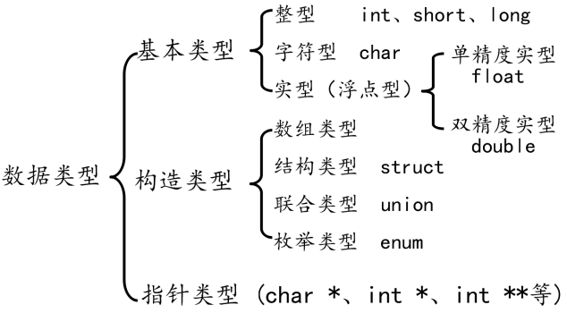

# C语言大纲 --*基于CPrimerPlus,C和指针,C基础讲义2018修订版*

> 下文引用于《CPrimerPlus》记为①；引用于《C和指针》记为②；引用于C基础讲义2018修订版记为③

## 目录

1. **C语言概述**

   1.0 计算机语言，语法

   1.1  翻译器，编译器，解释器

   1.2 语言标准: K&R ANSI/C89/C90 C99 C11

   1.3 编译环境和常见编译器

   1.4 关键字,保留标识符和标识符 *--① Ch 2.8 Ch 3.3 --② Ch 2.2.4*

   1.5 程序风格
2. **数据**
   2.1 声明，定义和初始化 *--③ Ch 2.1.4*

   2.2 基本数据类型：整形；浮点；指针；聚合类型 *--② Ch 3.1*
   分法与①③不同。
   
   见*③ Ch 2.1.1*

   2.3 变量和常量
3. **运算符，表达式与语句**

   - 运算符

   | 运算符类型   | 作用                                   |
   | ------------ | -------------------------------------- |
   | 算术运算符   | 用于处理四则运算                       |
   | 赋值运算符   | 用于将表达式的值赋给变量               |
   | 比较运算符   | 用于表达式的比较，并返回一个真值或假值 |
   | 逻辑运算符   | 用于根据表达式的值返回真值或假值       |
   | 位运算符     | 用于处理数据的位运算                   |
   | sizeof运算符 | 用于求字节数长度                       |

   - 表达式 *--① Ch 5.4*
   - 语句：
     1. 简单语句：以一个分号结尾：空语句，函数表达式语句，赋值表达式语句等
     2. 复合语句（块）
     3. 控制语句：循环；分支和跳转；多重选择；goto

   3.1 左值和右值 *--② Ch 5.3*
4. 数组 *--见array*
   4.1 概述
   4.2 数组名
   4.3 初始化
   4.4 下标和边界
   4.5 数组和指针和函数
   4.6 多维数组
5. 字符串
6. 指针
7. 函数
8. 内存管理
9. 结构体
10. 文件输入输出
11. 预处理器
12. C库
13. ADT
